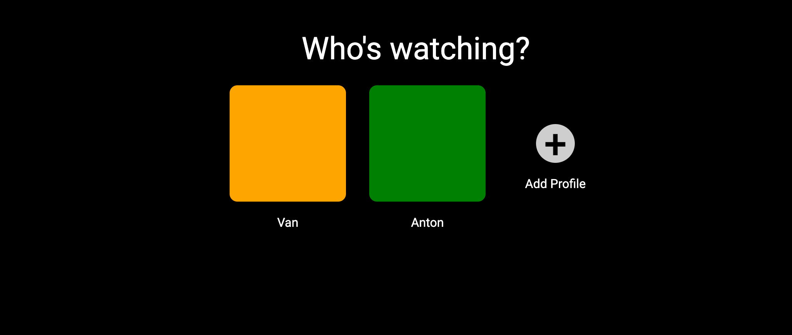
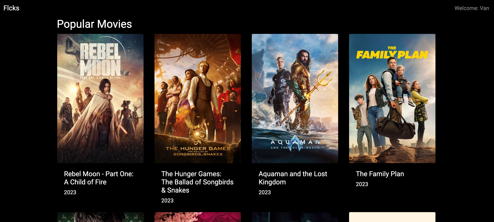
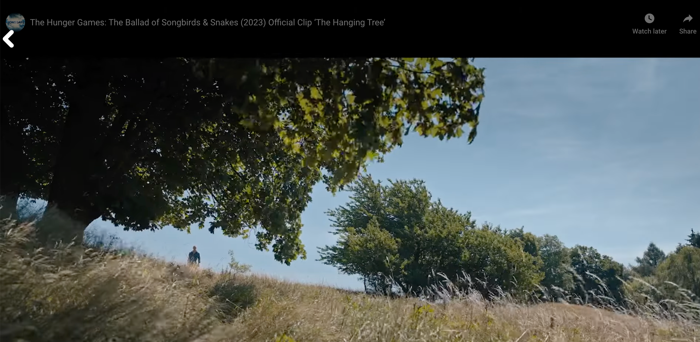

# Flcks

A streaming-style frontend application built with React. Browse popular movies pulled from the TMDB API, preview details in a cinematic modal, and watch trailers in a full-screen player.

Built as a portfolio project to demonstrate component architecture, client-side routing, API integration, and intentional UI design in a realistic product context.

**Live demo:** [van-code.github.io/streaming-app](https://van-code.github.io/streaming-app)

---

## Features

- **Profile selection** — Choose or create a viewer profile before browsing
- **Cinematic hero** — Featured movie displayed with a full-width backdrop, synopsis, and action buttons
- **Browse grid** — Responsive movie card grid (2–5 columns) with hover overlays
- **Detail modal** — Movie backdrop, poster, rating, overview, and direct play action
- **Trailer playback** — Full-screen YouTube embed via TMDB video endpoint
- **Loading & error states** — Spinners, error messages, and empty states throughout
- **Keyboard accessible** — Cards, buttons, and modals are navigable by keyboard
- **Responsive** — Works across mobile, tablet, and desktop

---

## Tech Stack

| Layer | Technology |
|---|---|
| UI framework | React 18 |
| Routing | React Router 6 |
| Component library | React-Bootstrap 2 + Bootstrap 5 |
| Styling | CSS custom properties, component-scoped CSS |
| Typography | Inter (Google Fonts) |
| Data | TMDB API (The Movie Database) |
| Bundler | Create React App (react-scripts 5) |
| Deployment | GitHub Pages via GitHub Actions |

---

## Local Setup

### 1. Clone the repo

```bash
git clone https://github.com/van-code/streaming-app.git
cd streaming-app
```

### 2. Configure your TMDB API token

The app fetches movie data from [The Movie Database API](https://developer.themoviedb.org/). You need a free account and a read access token.

```bash
cp .env.example .env
```

Open `.env` and replace the placeholder:

```
REACT_APP_TMDB_TOKEN=your_tmdb_bearer_token_here
```

### 3. Install dependencies

```bash
npm install
```

### 4. Start the development server

```bash
npm start
```

Open [http://localhost:3000](http://localhost:3000). The app will reload on file changes.

---

## Scripts

| Command | Description |
|---|---|
| `npm start` | Start development server at localhost:3000 |
| `npm run build` | Create optimized production build in `build/` |
| `npm test` | Run tests (watch mode) |
| `npm run deploy` | Build and push to `gh-pages` branch manually |

---

## Folder Structure

```
streaming-app/
├── .github/
│   └── workflows/
│       ├── ci.yml          # Build + test on push/PR to main
│       └── deploy.yml      # Auto-deploy to GitHub Pages on push to main
├── public/
│   ├── index.html          # Inter font, meta tags, app title
│   └── manifest.json
├── src/
│   ├── assets/
│   │   └── icons/          # SVG assets used in components
│   ├── components/
│   │   ├── Details.js/css  # Movie detail modal (backdrop, poster, info, play)
│   │   ├── Home.js/css     # Browse page: hero section + movie grid
│   │   ├── Item.js/css     # Movie card with hover overlay
│   │   ├── Nav.js/css      # Fixed navigation bar with scroll behavior
│   │   ├── SelectProfile.js/css  # Profile selection screen
│   │   └── Watch.js/css    # Full-screen trailer player
│   ├── App.css             # Design tokens (CSS custom properties) + global styles
│   ├── App.js              # Root: routing, modal overlay pattern
│   ├── api.js              # TMDB fetch headers (reads env token)
│   ├── index.js            # React 18 createRoot entry point
│   └── utils.js            # Shared utilities (getYear)
├── .env.example            # Environment variable template
├── .gitignore
└── package.json
```

---

## Architecture

### Routing

The app uses React Router 6 with a modal overlay pattern. Three main routes:

```
/              → SelectProfile (no user) or Home (user set)
/watch/:id     → Watch (full-screen trailer player)
/modal         → Details (rendered on top of the previous location)
```

The modal pattern works by passing `previousLocation` in router state. When `/modal` is active, the app renders `Home` in the background and `Details` as an overlay. Closing the modal calls `navigate(-1)` to return.

```jsx
// App.js — simplified
<Routes location={previousLocation || location}>
  <Route path="/" element={user ? <Home /> : <SelectProfile />} />
  <Route path="/watch/:id" element={<Watch />} />
</Routes>
{previousLocation && (
  <Routes>
    <Route path="/modal" element={<Details movie={movie} />} />
  </Routes>
)}
```

### State management

No external state library. State is local to components:

- `user` — lifted to `App.js`, passed to `Nav` and used to gate routes
- `movies` — fetched and held in `Home.js`
- `videoKey` — fetched and held in `Watch.js`

Profile selection persists the profile ID to `localStorage` but does not restore it on reload (by design — profile selection is part of the UX flow).

### Styling approach

- Global design tokens in `App.css` as CSS custom properties (`--bg-base`, `--text-primary`, `--space-*`, etc.)
- Component-scoped `.css` files co-located with each component
- Bootstrap 5 used for Modal, Form, Spinner, and grid utilities; overridden at the token level in `App.css`
- No CSS Modules (consistent with the existing project pattern)

---

## API & Data Notes

All movie data is fetched live from [TMDB](https://www.themoviedb.org/).

| Endpoint | Used by | Purpose |
|---|---|---|
| `GET /movie/popular` | `Home.js` | Browse grid + hero (page 1, 20 results) |
| `GET /movie/:id/videos` | `Watch.js` | Fetch trailer key (prefers type "Trailer") |

Images are served from `https://image.tmdb.org/t/p/`:

| Size | Used for |
|---|---|
| `w1280` | Hero backdrop |
| `w780` | Modal backdrop |
| `w500` | Card poster |
| `w342` | Modal poster |

The app requires a valid TMDB bearer token set in `REACT_APP_TMDB_TOKEN`. Without it, all fetches will fail and the error state will be displayed.

---

## User Flow

```
1. App loads → SelectProfile screen
   ↓ User clicks a profile
2. Home screen → hero movie + browse grid
   ↓ User hovers a card (500ms) or clicks
3. Details modal → backdrop, poster, title, rating, overview
   ↓ User clicks Play
4. Watch screen → full-screen YouTube trailer embed
   ↓ User hovers → back button appears → click to return home
```

---

## Deployment

### Automatic (GitHub Actions)

Push to `main` triggers `.github/workflows/deploy.yml`, which builds the app and pushes the `build/` folder to the `gh-pages` branch using `peaceiris/actions-gh-pages`.

**Required setup:**
1. In your GitHub repo, go to **Settings → Secrets and variables → Actions**
2. Add `REACT_APP_TMDB_TOKEN` with your TMDB bearer token
3. Go to **Settings → Pages**, set source to **Deploy from branch**, branch `gh-pages`

### Manual

```bash
npm run deploy
```

Runs the build and pushes to `gh-pages` using the local `gh-pages` CLI.

---

## Known Limitations

- **GitHub Pages + BrowserRouter** — Deep links (e.g. `/watch/123`) will return a 404 on GitHub Pages because the server doesn't know to serve `index.html` for all routes. To fix, switch `BrowserRouter` to `HashRouter` in `src/index.js`. URLs will use the `#` pattern but all routes will work.
- **No auth** — Profile selection is cosmetic. There is no real authentication or user data persistence beyond `localStorage`.
- **No search** — The app only shows the "Popular Movies" endpoint. Searching or filtering by genre is not implemented.
- **React Scripts (CRA)** — The project uses Create React App, which is no longer actively maintained. A future migration to Vite would improve build performance and long-term maintainability.
- **API key exposure in client** — The TMDB token is embedded in the browser bundle at build time (this is a CRA limitation with `REACT_APP_*` variables). TMDB read tokens have read-only scope, so this is acceptable for a portfolio project.

---

## Future Improvements

- [ ] Migrate from CRA to Vite
- [ ] Add search and genre filtering
- [ ] Switch to HashRouter for reliable GitHub Pages routing
- [ ] Persist selected profile across sessions (currently resets on reload)
- [ ] Add a "My List" / watchlist feature using localStorage
- [ ] Add skeleton loading states for cards instead of a centered spinner
- [ ] Fetch additional movie details (genres, runtime, cast) for the modal
- [ ] Add CSS Modules or CSS-in-JS for stricter style encapsulation
- [ ] Write component unit tests with React Testing Library

---

## Screenshots

> Screenshots taken from the live demo at [van-code.github.io/streaming-app](https://van-code.github.io/streaming-app)

| Profile Selection | Browse / Hero | Detail Modal | Watch |
|---|---|---|---|
|  |  | *(see live demo)* |  |

---

## License

MIT
